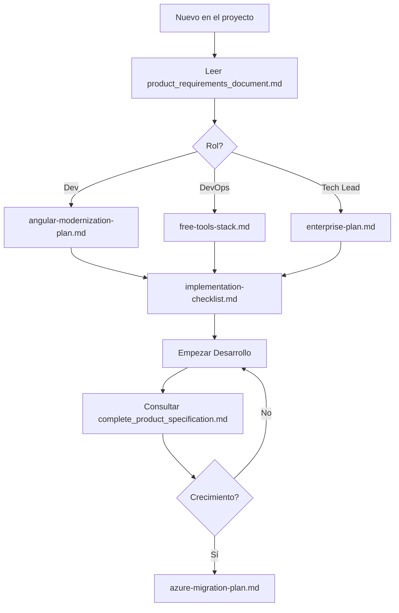

# 📚 Documentación Eventor - Índice General

**Última actualización:** 2025-12-05

---

## 🗂️ Estructura de Documentación

### `/docs/`

#### **Plan de Implementación** (`/plan-de-implementacion/`)
Documentos técnicos para la implementación actual con stack gratuito:

- **angular-modernization-plan.md** - Migración a Signals, OnPush y Control Flow
- **free-tools-stack.md** - Stack 100% gratuito (Vercel, Render, Supabase)
- **implementation-checklist.md** - Plan de 3 semanas con tareas específicas
- **azure-migration-plan.md** - Migración futura a Azure (cuando haya presupuesto)

#### **Planificación y Desarrollo** (`/planificacion-y-desarrollo/`)
Documentos de planificación estratégica:

- **enterprise-plan.md** - Arquitectura enterprise, CI/CD, ambientes, roles
- **implementation-status.md** - Estado actual del MVP (features implementadas)

#### **Especificaciones de Producto** (raíz `/docs/`)
Documentos de diseño y requerimientos:

- **complete_product_specification.md** - Especificación completa (50+ User Stories)
- **product_requirements_document.md** - PRD con visión y objetivos MVP
- **ui_ux_guidelines.md** - Guías de diseño (Glassmorphism, dark theme)
- **user_stories.md** - Historias de usuario detalladas
- **wireframes.md** - Descripciones de mockups
- **entity_diagram.md** - Diagrama de base de datos
- **roadmap.md** - Roadmap de features
- **README.md** - Índice de documentación

---

## 🚀 Cómo Usar Esta Documentación

### Para Empezar a Desarrollar

1. **Lee primero:**
   - `/docs/plan-de-implementacion/angular-modernization-plan.md`
   - `/docs/plan-de-implementacion/implementation-checklist.md`

2. **Ejecuta:**
   ```bash
   # Fase 1: Setup
   cd frontend
   ng update @angular/core@18 --force
   npm install
   ```

3. **Sigue el checklist día por día**

---

### Para Entender el Producto

1. **Lee primero:**
   - `/docs/product_requirements_document.md`
   - `/docs/ui_ux_guidelines.md`

2. **Consulta:**
   - `/docs/complete_product_specification.md` para ver todas las features
   - `/docs/user_stories.md` para entender los flujos de usuario

---

### Para Planificar Escalabilidad

1. **Lee primero:**
   - `/docs/planificacion-y-desarrollo/enterprise-plan.md`

2. **Cuando tengas presupuesto:**
   - `/docs/plan-de-implementacion/azure-migration-plan.md`

---

## 📖 Descripción de Cada Documento

### 1. angular-modernization-plan.md
**Audiencia:** Desarrolladores Frontend  
**Contenido:** 
- Qué son Angular Signals
- Input signals vs @Input
- Change Detection OnPush
- Control Flow (@if, @for, @switch)
- 10+ ejemplos de código
- Migración de componentes reales

**Cuándo leer:** Antes de empezar cualquier desarrollo

---

### 2. free-tools-stack.md
**Audiencia:** Desarrolladores Full Stack, DevOps  
**Contenido:**
- Stack 100% gratuito
- Vercel (Frontend hosting)
- Render (Backend hosting)
- Supabase (Database)
- GitHub Actions (CI/CD)
- Sentry (Monitoring)
- Configuraciones completas

**Cuándo leer:** Al configurar infraestructura

---

### 3. implementation-checklist.md
**Audiencia:** Todo el equipo  
**Contenido:**
- Plan de 3 semanas día por día
- Fases: Setup → Migración → Testing → Deploy → Monitoring
- Checklist ejecutable
- Código específico para cada tarea
- Criterios de éxito

**Cuándo leer:** Como guía diaria de trabajo

---

### 4. azure-migration-plan.md
**Audiencia:** DevOps, Tech Lead, Management  
**Contenido:**
- Cuándo migrar a Azure
- Comparativa de costos (Gratis vs Azure Básico vs Enterprise)
- Arquitectura Azure objetivo
- Plan de migración fase por fase
- Estimaciones de costos ($44-$2,798/mes según escala)
- Rollback plan

**Cuándo leer:** Cuando tengas >10K usuarios o presupuesto disponible

---

### 5. enterprise-plan.md
**Audiencia:** Tech Lead, Arquitectos, Gerencia  
**Contenido:**
- Arquitectura enterprise-grade
- CI/CD profesional
- 4 ambientes (Dev, QA, Staging, Prod)
- Roles y permisos
- GitFlow branching strategy
- Documentación operativa
- Roadmap de 10 semanas

**Cuándo leer:** Al planificar escalamiento del equipo

---

### 6. implementation-status.md
**Audiencia:** Product Owner, Gerencia, QA  
**Contenido:**
- Estado actual del MVP
- Features implementadas (18/50)
- Gaps identificados
- Cobertura de User Stories
- Próximos pasos

**Cuándo leer:** Para reportes de avance

---

### 7. complete_product_specification.md
**Audiencia:** Todo el equipo  
**Contenido:**
- 50+ User Stories
- Acceptance Criteria en formato Gherkin
- Módulos: Auth, Discovery, Events, Tickets, Profile, B2B, Admin
- Especificaciones técnicas

**Cuándo leer:** Como referencia constante

---

## 🎯 Decisión Rápida: ¿Qué Leer?

### Soy Developer Frontend
1. `angular-modernization-plan.md` ⭐
2. `implementation-checklist.md`
3. `free-tools-stack.md` (sección Frontend)

### Soy Developer Backend
1. `implementation-checklist.md`
2. `free-tools-stack.md` (secciones Backend/DB)
3. `azure-migration-plan.md` (futuro)

### Soy DevOps
1. `free-tools-stack.md` ⭐
2. `enterprise-plan.md` (sección CI/CD)
3. `azure-migration-plan.md`

### Soy Tech Lead / Arquitecto
1. `enterprise-plan.md` ⭐
2. `azure-migration-plan.md`
3. Todos los demás como referencia

### Soy Product Owner / QA
1. `implementation-status.md` ⭐
2. `complete_product_specification.md`
3. `product_requirements_document.md`

---

## 🔄 Flujo de Trabajo Recomendado



---

## 📝 Convenciones

### Formato de Archivos

- **Markdown (.md)** - Todos los documentos
- Para convertir a Word: `pandoc file.md -o file.docx`
- Para convertir a PDF: `pandoc file.md -o file.pdf`

### Versionado

Todos los documentos incluyen:
- Versión
- Fecha de última actualización
- Objetivos claros

---

## 🆘 Soporte

Si tienes dudas sobre qué documento leer, pregúntate:

**¿Quiero implementar algo HOY?**  
→ `implementation-checklist.md`

**¿Necesito entender cómo funciona X?**  
→ `complete_product_specification.md`

**¿Debo planificar el futuro?**  
→ `enterprise-plan.md` o `azure-migration-plan.md`

**¿Qué herramientas uso?**  
→ `free-tools-stack.md`

---

## 🔥 Quick Start

```bash
# 1. Leer documentación esencial
cat docs/plan-de-implementacion/implementation-checklist.md

# 2. Configurar proyecto
cd frontend
ng update @angular/core@18 --force

# 3. Seguir checklist
# Ver Fase 1: Día 1 en implementation-checklist.md
```

---

**¿Todo listo?** ¡Empieza por `implementation-checklist.md`! 🚀
