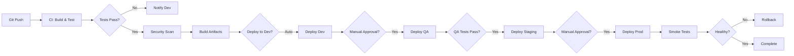

# 🏗️ Eventor - Plan Integral de Arquitectura, Operaciones y CI/CD

**Versión:** 1.0  
**Fecha:** 2025-12-05  
**Objetivo:** Transformar Eventor de MVP a plataforma enterprise-grade lista para equipos

---

## 📋 Índice

1. [Arquitectura Final y Diseño Técnico](#1-arquitectura-final-y-diseño-técnico)
2. [CI/CD Profesional](#2-cicd-profesional)
3. [Definición de Ambientes](#3-definición-de-ambientes)
4. [Gestión de Roles y Flujos](#4-gestión-de-roles-y-flujos)
5. [Documentación Operativa](#5-documentación-operativa)
6. [Roadmap de Implementación](#6-roadmap-de-implementación)

---

## 1. Arquitectura Final y Diseño Técnico

### 1.1 Visión Arquitectónica

**Arquitectura Objetivo:** Microservicios Modulares con Frontend SPA

```
┌─────────────────────────────────────────────────────────────┐
│                        USUARIOS                              │
│  (Web Browser, Mobile App futuro, Admin Panel)              │
└─────────────────────────────────────────────────────────────┘
                           │
                           ▼
┌─────────────────────────────────────────────────────────────┐
│                    CDN / STATIC HOSTING                      │
│                  (Azure Static Web Apps)                     │
│                       Angular SPA                            │
└─────────────────────────────────────────────────────────────┘
                           │
                           ▼
┌─────────────────────────────────────────────────────────────┐
│                    API GATEWAY / PROXY                       │
│              (Azure API Management / NGINX)                  │
│         Rate Limiting, Auth, Logging, Caching                │
└─────────────────────────────────────────────────────────────┘
                           │
        ┌──────────────────┼──────────────────┐
        ▼                  ▼                  ▼
┌─────────────┐    ┌─────────────┐    ┌─────────────┐
│  Auth API   │    │  Core API   │    │  B2B API    │
│  (Identity) │    │  (Events)   │    │(Organizers) │
│   .NET 8    │    │   .NET 8    │    │   .NET 8    │
└─────────────┘    └─────────────┘    └─────────────┘
        │                  │                  │
        └──────────────────┼──────────────────┘
                           ▼
          ┌────────────────────────────────┐
          │   Shared Infrastructure         │
          ├────────────────────────────────┤
          │ • SQL Server (Azure SQL)       │
          │ • Redis Cache                  │
          │ • Blob Storage (Images/QR)     │
          │ • Application Insights         │
          │ • Key Vault (Secrets)          │
          └────────────────────────────────┘
```

### 1.2 Componentes Actuales vs. Propuestos

#### **Frontend (Angular 18)**

| Componente Actual | Estado | Componente Propuesto | Justificación |
|-------------------|--------|---------------------|---------------|
| Standalone Components | ✅ OK | Mantener + Lazy Loading | Performance y code splitting |
| TailwindCSS | ✅ OK | Mantener + Design Tokens | Consistencia de diseño |
| Leaflet Maps | ✅ OK | Mantener + CDN | Reducir bundle size |
| Auth Guards | ✅ OK | Mejorar + RBAC Guards | Control granular de permisos |
| No State Management | ⚠️ Mejorar | NgRx o Akita | Predictibilidad y debugging |
| No Error Boundary | ❌ Falta | Implementar | UX resiliente |
| No PWA | ❌ Falta | Service Workers | Offline-first, push notifications |

**Cambios Recomendados:**

```typescript
// Estructura propuesta
frontend/
├── src/
│   ├── app/
│   │   ├── core/                    # Singleton services
│   │   │   ├── auth/
│   │   │   ├── error-handling/
│   │   │   ├── logging/
│   │   │   └── http-interceptors/
│   │   ├── shared/                  # Reusable components
│   │   │   ├── components/
│   │   │   ├── directives/
│   │   │   ├── pipes/
│   │   │   └── models/
│   │   ├── features/                # Feature modules
│   │   │   ├── auth/
│   │   │   ├── discovery/
│   │   │   ├── events/
│   │   │   ├── tickets/
│   │   │   └── organizer/
│   │   ├── store/                   # NgRx state
│   │   │   ├── events/
│   │   │   ├── user/
│   │   │   └── ui/
│   │   └── environments/
│   ├── assets/
│   └── styles/
│       ├── abstracts/              # Variables, mixins
│       ├── base/                   # Reset, typography
│       ├── components/             # Component styles
│       └── utilities/              # Helpers
├── .env.{environment}
└── angular.json
```

#### **Backend (.NET 8 API)**

| Componente Actual | Estado | Componente Propuesto | Justificación |
|-------------------|--------|---------------------|---------------|
| Monolito API | ✅ OK (MVP) | Separar en módulos | Escalabilidad independiente |
| EF Core + SQL Server | ✅ OK | Mantener + Migrations | ORM maduro, Azure SQL compatible |
| Identity + JWT | ✅ OK | Mejorar + Refresh Tokens | Seguridad mejorada |
| No Logging estructurado | ❌ Falta | Serilog + Seq/AppInsights | Observabilidad |
| No Health Checks | ❌ Falta | ASP.NET Health Checks | Monitoreo automático |
| No API Versioning | ❌ Falta | Asp.Versioning.Mvc | Evolución sin breaking changes |
| No Rate Limiting | ❌ Falta | AspNetCoreRateLimit | Protección contra abuso |

**Estructura Propuesta (Clean Architecture):**

```
backend/
├── src/
│   ├── Eventor.API/                # Entry point
│   │   ├── Controllers/
│   │   ├── Middleware/
│   │   ├── Filters/
│   │   ├── Program.cs
│   │   └── appsettings.{env}.json
│   ├── Eventor.Application/        # Business logic
│   │   ├── Services/
│   │   ├── DTOs/
│   │   ├── Interfaces/
│   │   ├── Validators/             # FluentValidation
│   │   └── Mappings/               # AutoMapper
│   ├── Eventor.Domain/             # Core entities
│   │   ├── Entities/
│   │   ├── Enums/
│   │   ├── ValueObjects/
│   │   └── Exceptions/
│   ├── Eventor.Infrastructure/     # External concerns
│   │   ├── Data/
│   │   │   ├── Context/
│   │   │   ├── Migrations/
│   │   │   └── Repositories/
│   │   ├── Identity/
│   │   ├── Caching/                # Redis
│   │   ├── Storage/                # Blob
│   │   └── Logging/
│   └── Eventor.Shared/             # Cross-cutting
│       ├── Constants/
│       ├── Extensions/
│       └── Helpers/
├── tests/
│   ├── Eventor.UnitTests/
│   ├── Eventor.IntegrationTests/
│   └── Eventor.E2ETests/           # Playwright
├── docker/
│   ├── Dockerfile.api
│   └── docker-compose.yml
└── .env.{environment}
```

### 1.3 Decisiones Arquitectónicas (ADRs)

#### **ADR-001: Separación Frontend/Backend**

**Decisión:** SPA Angular separada de API .NET  
**Razón:** 
- Escalabilidad independiente
- Equipos especializados pueden trabajar en paralelo
- Deploy independiente (frontend en CDN, backend en App Service)
- Reutilización de API para futuras apps mobile

**Consecuencias:**
- Necesidad de CORS bien configurado
- Autenticación con tokens
- Complejidad de deployment multi-componente

---

#### **ADR-002: SQL Server sobre NoSQL**

**Decisión:** Azure SQL Database como BD principal  
**Razón:**
- Transacciones ACID requeridas (compras de tickets)
- Esquema estructurado (eventos, usuarios, tickets)
- Expertise del equipo en SQL
- Azure SQL ofrece escalabilidad gestionada

**Consecuencias:**
- Costo más alto que CosmosDB
- Migración a geo-replication más compleja
- Requiere diseño de índices óptimo

---

#### **ADR-003: JWT con Refresh Tokens**

**Decisión:** Autenticación stateless con JWT + Refresh Tokens en DB  
**Razón:**
- Escalabilidad (no session server-side)
- Microservicios pueden validar tokens sin llamar a Auth service
- Refresh tokens permiten revocación

**Implementación:**
```csharp
// Eventor.Application/Services/AuthService.cs
public class AuthService {
    public async Task<LoginResponse> Login(LoginRequest request) {
        // 1. Validar credenciales
        // 2. Generar Access Token (15 min)
        // 3. Generar Refresh Token (7 días) y guardar en DB
        // 4. Retornar ambos tokens
    }
    
    public async Task<RefreshResponse> RefreshToken(string refreshToken) {
        // 1. Validar refresh token en DB
        // 2. Si es válido y no expiró, generar nuevo Access Token
        // 3. Rotar Refresh Token (opcional)
    }
}
```

---

#### **ADR-004: Redis para Caching**

**Decisión:** Azure Redis Cache para datos temporales  
**Razón:**
- Reducir carga en SQL para queries frecuentes (eventos, categorías)
- Session storage para autenticación
- Rate limiting distribuido

**Estrategia:**
```csharp
// Cache events por categoría (TTL 5 min)
var cacheKey = $"events:category:{category}";
var cachedEvents = await _cache.GetAsync<List<Event>>(cacheKey);
if (cachedEvents == null) {
    cachedEvents = await _dbContext.Events.Where(...).ToListAsync();
    await _cache.SetAsync(cacheKey, cachedEvents, TimeSpan.FromMinutes(5));
}
```

---

### 1.4 Estándares de Código

#### **Frontend (Angular)**

```typescript
// ✅ BUENAS PRÁCTICAS

// 1. Naming Conventions
export class EventDetailComponent { }  // PascalCase para clases
export interface Event { }              // PascalCase para interfaces
private readonly apiUrl: string;        // camelCase para propiedades

// 2. Observables siempre terminan en $
events$: Observable<Event[]>;
selectedEvent$ = this.store.select(selectEvent);

// 3. Unsubscribe automático
ngOnDestroy() {
  this.destroy$.next();
  this.destroy$.complete();
}

// 4. Manejo de errores centralizado
this.eventService.getEvents().pipe(
  catchError(this.errorHandler.handle)
).subscribe();

// 5. Tipos estrictos
interface LoginRequest {
  email: string;
  password: string;
}
// NO usar 'any'
```

#### **Backend (.NET)**

```csharp
// ✅ BUENAS PRÁCTICAS

// 1. Async/Await consistently
public async Task<ActionResult<IEnumerable<Event>>> GetEvents(
    [FromQuery] string? category
) {
    var events = await _service.GetEventsAsync(category);
    return Ok(events);
}

// 2. Repository Pattern
public interface IEventRepository {
    Task<Event?> GetByIdAsync(int id);
    Task<IEnumerable<Event>> GetAllAsync();
    Task<Event> AddAsync(Event entity);
}

// 3. DTOs para API responses
public record EventDto(
    int Id,
    string Title,
    DateTime Date,
    decimal Price
);

// 4. FluentValidation
public class CreateEventValidator : AbstractValidator<CreateEventDto> {
    public CreateEventValidator() {
        RuleFor(x => x.Title).NotEmpty().MaximumLength(200);
        RuleFor(x => x.Date).GreaterThan(DateTime.UtcNow);
    }
}

// 5. Global Exception Handling
app.UseExceptionHandler("/error");
app.UseMiddleware<GlobalExceptionMiddleware>();
```

### 1.5 Seguridad

#### **Checklist de Seguridad**

```yaml
Autenticación:
  - ✅ Passwords hasheados con bcrypt/Identity
  - ✅ JWT con expiración corta (15 min)
  - ⚠️ Implementar Refresh Tokens
  - ⚠️ Rate limiting en login (5 intentos/min)
  
Autorización:
  - ✅ Role-based (User, Organizer, Admin)
  - ⚠️ Implementar Claims-based para permisos granulares
  - ❌ Implementar API scopes

API Security:
  - ✅ HTTPS only
  - ✅ CORS configurado
  - ⚠️ Input validation (FluentValidation)
  - ❌ SQL Injection protection (usar EF Core parametrizado)
  - ❌ XSS protection (sanitizar HTML)
  - ❌ CSRF tokens para formularios

Secrets Management:
  - ❌ Migrar a Azure Key Vault
  - ❌ No hardcodear secrets en código
  - ❌ Rotar secrets regularmente

Dependencies:
  - ❌ Dependabot para updates automáticos
  - ❌ Snyk/GitHub Security Alerts
```

**Implementación Recomendada:**

```csharp
// Program.cs
builder.Services.AddRateLimiter(options => {
    options.AddFixedWindowLimiter("api", opt => {
        opt.Window = TimeSpan.FromMinutes(1);
        opt.PermitLimit = 100;
    });
});

// Secrets en Azure Key Vault
builder.Configuration.AddAzureKeyVault(
    new Uri($"https://{keyVaultName}.vault.azure.net/"),
    new DefaultAzureCredential()
);
```

### 1.6 Logging y Observabilidad

#### **Stack Recomendado:**

```
Application Insights (Azure)
    ↓
Serilog (Structured Logging)
    ↓
┌────────────┬────────────┬────────────┐
│   Traces   │   Metrics  │    Logs    │
└────────────┴────────────┴────────────┘
```

**Implementación:**

```csharp
// appsettings.json
{
  "Serilog": {
    "MinimumLevel": {
      "Default": "Information",
      "Override": {
        "Microsoft": "Warning",
        "System": "Warning"
      }
    },
    "WriteTo": [
      {
        "Name": "Console"
      },
      {
        "Name": "ApplicationInsights",
        "Args": {
          "telemetryConverter": "Serilog.Sinks.ApplicationInsights.TelemetryConverters.TraceTelemetryConverter, Serilog.Sinks.ApplicationInsights"
        }
      }
    ],
    "Enrich": ["FromLogContext", "WithMachineName", "WithThreadId"]
  }
}
```

```csharp
// Usage
_logger.LogInformation(
    "Event {EventId} purchased by user {UserId} for {Price}",
    eventId,
    userId,
    price
);
```

**Métricas Clave:**

```yaml
Performance:
  - API response time (p50, p95, p99)
  - Database query duration
  - Cache hit/miss ratio

Business:
  - Tickets sold per hour
  - Active users
  - Conversion rate (views → purchases)

Errors:
  - 4xx/5xx rates
  - Failed logins
  - Payment failures
```

---

## 2. CI/CD Profesional

### 2.1 Pipeline Overview



### 2.2 Herramientas Recomendadas

**Opción A: GitHub Actions** (Recomendada)
- ✅ Gratis para repos privados (2000 min/mes)
- ✅ Integración nativa con GitHub
- ✅ Marketplace amplio
- ✅ Self-hosted runners disponibles

**Opción B: Azure DevOps**
- ✅ Integración perfecta con Azure
- ✅ Pipelines YAML o visual
- ✅ Boards + Repos + Pipelines integrados

**Opción C: GitLab CI/CD**
- ✅ Todo-en-uno (Git + CI + CD)
- ✅ GitLab Runners flexibles

**➡️ Recomendación: GitHub Actions + Azure para deploy**

### 2.3 Pipeline Detallado

#### **Archivo: `.github/workflows/ci-cd.yml`**

```yaml
name: Eventor CI/CD

on:
  push:
    branches: [main, develop, 'release/**']
  pull_request:
    branches: [main, develop]

env:
  NODE_VERSION: '20.x'
  DOTNET_VERSION: '8.0.x'
  AZURE_WEBAPP_NAME: eventor-api

jobs:
  # ========================================
  # JOB 1: Build & Test Frontend
  # ========================================
  frontend-ci:
    runs-on: ubuntu-latest
    defaults:
      run:
        working-directory: ./frontend
    
    steps:
      - uses: actions/checkout@v4
      
      - name: Setup Node.js
        uses: actions/setup-node@v4
        with:
          node-version: ${{ env.NODE_VERSION }}
          cache: 'npm'
          cache-dependency-path: frontend/package-lock.json
      
      - name: Install dependencies
        run: npm ci
      
      - name: Lint
        run: npm run lint
      
      - name: Unit Tests
        run: npm run test:ci
      
      - name: Build
        run: npm run build -- --configuration=production
      
      - name: Upload artifacts
        uses: actions/upload-artifact@v4
        with:
          name: frontend-dist
          path: frontend/dist/
          retention-days: 7

  # ========================================
  # JOB 2: Build & Test Backend
  # ========================================
  backend-ci:
    runs-on: ubuntu-latest
    defaults:
      run:
        working-directory: ./backend
    
    steps:
      - uses: actions/checkout@v4
      
      - name: Setup .NET
        uses: actions/setup-dotnet@v4
        with:
          dotnet-version: ${{ env.DOTNET_VERSION }}
      
      - name: Restore dependencies
        run: dotnet restore
      
      - name: Build
        run: dotnet build --no-restore --configuration Release
      
      - name: Unit Tests
        run: dotnet test --no-build --configuration Release --verbosity normal --collect:"XPlat Code Coverage"
      
      - name: Publish
        run: dotnet publish -c Release -o ./publish
      
      - name: Upload artifacts
        uses: actions/upload-artifact@v4
        with:
          name: backend-publish
          path: backend/publish/
          retention-days: 7

  # ========================================
  # JOB 3: Security Scanning
  # ========================================
  security-scan:
    runs-on: ubuntu-latest
    needs: [frontend-ci, backend-ci]
    
    steps:
      - uses: actions/checkout@v4
      
      - name: Run Snyk Security Scan
        uses: snyk/actions/node@master
        env:
          SNYK_TOKEN: ${{ secrets.SNYK_TOKEN }}
        with:
          args: --severity-threshold=high
          command: test
      
      - name: Run Trivy vulnerability scanner
        uses: aquasecurity/trivy-action@master
        with:
          scan-type: 'fs'
          scan-ref: '.'
          format: 'sarif'
          output: 'trivy-results.sarif'
      
      - name: Upload Trivy results to GitHub Security
        uses: github/codeql-action/upload-sarif@v3
        with:
          sarif_file: 'trivy-results.sarif'

  # ========================================
  # JOB 4: Deploy to DEV
  # ========================================
  deploy-dev:
    runs-on: ubuntu-latest
    needs: [frontend-ci, backend-ci]
    if: github.ref == 'refs/heads/develop'
    environment:
      name: Development
      url: https://dev.eventor.com
    
    steps:
      - name: Download frontend artifact
        uses: actions/download-artifact@v4
        with:
          name: frontend-dist
          path: ./frontend-dist
      
      - name: Download backend artifact
        uses: actions/download-artifact@v4
        with:
          name: backend-publish
          path: ./backend-publish
      
      - name: Azure Login
        uses: azure/login@v1
        with:
          creds: ${{ secrets.AZURE_CREDENTIALS_DEV }}
      
      - name: Deploy Frontend to Azure Static Web Apps
        run: |
          az staticwebapp upload \
            --name eventor-frontend-dev \
            --resource-group rg-eventor-dev \
            --source ./frontend-dist
      
      - name: Deploy Backend to Azure App Service
        uses: azure/webapps-deploy@v2
        with:
          app-name: ${{ env.AZURE_WEBAPP_NAME }}-dev
          package: ./backend-publish
      
      - name: Run Database Migrations
        run: |
          # Apply EF migrations
          dotnet ef database update --project ./backend/Eventor.API
        env:
          ConnectionStrings__DefaultConnection: ${{ secrets.DB_CONNECTION_DEV }}

  # ========================================
  # JOB 5: Deploy to QA
  # ========================================
  deploy-qa:
    runs-on: ubuntu-latest
    needs: [deploy-dev]
    if: github.ref == 'refs/heads/develop'
    environment:
      name: QA
      url: https://qa.eventor.com
    
    steps:
      # Similar a deploy-dev pero con secrets de QA
      # ...

  # ========================================
  # JOB 6: Deploy to STAGING
  # ========================================
  deploy-staging:
    runs-on: ubuntu-latest
    needs: [security-scan]
    if: startsWith(github.ref, 'refs/heads/release/')
    environment:
      name: Staging
      url: https://staging.eventor.com
    
    steps:
      # ...

  # ========================================
  # JOB 7: Deploy to PRODUCTION
  # ========================================
  deploy-production:
    runs-on: ubuntu-latest
    needs: [deploy-staging]
    if: github.ref == 'refs/heads/main'
    environment:
      name: Production
      url: https://eventor.com
    
    steps:
      - name: Download artifacts
        # ...
      
      - name: Azure Login
        # ...
      
      - name: Deploy with Blue-Green
        run: |
          # Deploy to staging slot
          az webapp deployment slot create \
            --name eventor-api-prod \
            --resource-group rg-eventor-prod \
            --slot staging
          
          # Deploy artifact to staging slot
          az webapp deploy \
            --name eventor-api-prod \
            --resource-group rg-eventor-prod \
            --slot staging \
            --src-path ./backend-publish.zip
          
          # Run smoke tests
          curl -f https://eventor-api-prod-staging.azurewebsites.net/health || exit 1
          
          # Swap slots
          az webapp deployment slot swap \
            --name eventor-api-prod \
            --resource-group rg-eventor-prod \
            --slot staging \
            --target-slot production
      
      - name: Create GitHub Release
        uses: actions/create-release@v1
        env:
          GITHUB_TOKEN: ${{ secrets.GITHUB_TOKEN }}
        with:
          tag_name: v${{ github.run_number }}
          release_name: Release v${{ github.run_number }}
          body: Auto-generated release
```

### 2.4 Versionado Semántico

**Estrategia:** SemVer 2.0 (MAJOR.MINOR.PATCH)

```
v1.2.3
│ │ │
│ │ └─ PATCH: Bug fixes, hotfixes
│ └─── MINOR: New features (backwards compatible)
└───── MAJOR: Breaking changes

Ejemplos:
v1.0.0 → MVP Launch
v1.1.0 → Added Reviews feature
v1.1.1 → Fixed map markers bug
v2.0.0 → Migrated to microservices
```

**Implementación:**

```bash
# .github/workflows/release.yml
- name: Bump version
  id: bump
  uses: anothrNick/github-tag-action@1.67.0
  env:
    GITHUB_TOKEN: ${{ secrets.GITHUB_TOKEN }}
    WITH_V: true
    DEFAULT_BUMP: patch
```

### 2.5 Rollback Strategy

**Automated Rollback:**

```yaml
# Monitoreo post-deploy
- name: Health Check
  run: |
    for i in {1..10}; do
      if curl -f https://eventor.com/health; then
        echo "✅ Health check passed"
        exit 0
      fi
      sleep 30
    done
    echo "❌ Health check failed - triggering rollback"
    exit 1

- name: Rollback on failure
  if: failure()
  run: |
    az webapp deployment slot swap \
      --name eventor-api-prod \
      --slot production \
      --target-slot staging
```

---

## 3. Definición de Ambientes

### 3.1 Esquema Multi-Ambiente

| Ambiente | URL | Propósito | Data | Deploy |
|----------|-----|-----------|------|--------|
| **Development** | `http://localhost:4200` | Desarrollo activo local | Mock/Seed | Manual |
| **DEV** | `https://dev.eventor.com` | Integración continua | Seed real | Auto (push a `develop`) |
| **QA/Test** | `https://qa.eventor.com` | Testing funcional/QA

 | Seed + manual testing | Auto post-DEV |
| **Staging** | `https://staging.eventor.com` | Pre-prod, réplica exacta | Sanitized prod snapshot | Auto (tag release) |
| **Production** | `https://eventor.com` | Live production | Producción | Manual approval |

### 3.2 Configuración por Ambiente

#### **Frontend: `environment.*.ts`**

```typescript
// environment.dev.ts
export const environment = {
  production: false,
  apiUrl: 'https://api-dev.eventor.com',
  appInsightsKey: 'dev-instrumentation-key',
  enableDevTools: true,
  logLevel: 'debug'
};

// environment.prod.ts
export const environment = {
  production: true,
  apiUrl: 'https://api.eventor.com',
  appInsightsKey: 'prod-instrumentation-key',
  enableDevTools: false,
  logLevel: 'error'
};
```

#### **Backend: `appsettings.{env}.json`**

```json
// appsettings.Development.json
{
  "ConnectionStrings": {
    "DefaultConnection": "Server=(localdb)\\mssqllocaldb;Database=EventorDev"
  },
  "Logging": {
    "LogLevel": {
      "Default": "Debug"
    }
  },
  "AllowedHosts": "*"
}

// appsettings.Production.json
{
  "ConnectionStrings": {
    "DefaultConnection": "#{DB_CONNECTION_STRING}#"  // Token replaced by pipeline
  },
  "Logging": {
    "LogLevel": {
      "Default": "Warning"
    }
  },
  "AllowedHosts": "eventor.com"
}
```

### 3.3 Gestión de Secretos

**Azure Key Vault Structure:**

```
eventor-keyvault-dev/
├── ConnectionStrings--DefaultConnection
├── JwtSettings--SecretKey
├── Stripe--SecretKey
├── SendGrid--ApiKey
└── BlobStorage--ConnectionString

eventor-keyvault-prod/
├── (same keys, different values)
```

**Acceso desde Código:**

```csharp
builder.Configuration.AddAzureKeyVault(
    new Uri($"https://eventor-kv-{environment}.vault.azure.net/"),
    new DefaultAzureCredential()
);
```

### 3.4 Matriz de Permisos por Ambiente

| Rol | Development | DEV | QA | Staging | Production |
|-----|-------------|-----|-----|---------|-----------|
| **Developer** | Full access | Read/Write | Read | Read | No access |
| **QA Engineer** | Read | Read | Full access | Read | No access |
| **DevOps** | Full | Full | Full | Full | Deploy only |
| **Tech Lead** | Full | Full | Full | Full | Read/Deploy/Rollback |
| **Client/PO** | No | View logs | View | View | View logs |

### 3.5 Data Management

#### **Development (Local)**
```sql
-- Seed script: seed-development.sql
INSERT INTO Events (Title, Date, Location, Price, Category) VALUES
('Test Event 1', GETDATE(), 'Córdoba', 100, 'Music'),
('Test Event 2', GETDATE(), 'Córdoba', 0, 'Art');
```

#### **DEV/QA**
- Ejecutar `DataSeeder.cs` automáticamente en startup
- 50+ eventos ficticios pero realistas

#### **Staging**
```bash
# Snapshot sanitizado de producción
az sql db copy \
  --resource-group rg-eventor-prod \
  --server eventor-sql-prod \
  --name Eventor \
  --dest-name Eventor-Staging \
  --dest-server eventor-sql-staging

# Sanitizar datos personales
UPDATE Users SET Email = CONCAT('user', Id, '@test.com'), Phone = NULL;
UPDATE Tickets SET QRCode = NEWID();
```

#### **Production**
- Backups automáticos diarios
- Point-in-time restore habilitado
- Geo-replication para DR

---

## 4. Gestión de Roles y Flujos

### 4.1 Roles del Equipo

#### **Developer (Backend/Frontend)**
- **Responsabilidades:**
  - Implementar features según specs
  - Escribir unit tests
  - Code reviews
  - Documentar código
- **Acceso:**
  - Git: crear branches, PRs
  - Ambientes: Local, DEV (read)
  - Secrets: Dev secrets only
- **Herramientas:**
  - VS Code / Visual Studio / Rider
  - Postman / Swagger
  - Azure Data Studio

#### **QA Engineer**
- **Responsabilidades:**
  - Crear test plans
  - Ejecutar tests manuales/automatizados
  - Reportar bugs
  - Aprobar releases a Staging
- **Acceso:**
  - Git: read-only
  - Ambientes: QA (full), Staging (read)
  - Azure Test Plans
- **Herramientas:**
  - Playwright / Selenium
  - Postman
  - Azure DevOps Boards

#### **DevOps Engineer**
- **Responsabilidades:**
  - Mantener CI/CD pipelines
  - Gestionar infraestructura (IaC)
  - Monitoreo y alertas
  - Incident response
- **Acceso:**
  - Git: Full (incluyendo protecciones)
  - Ambientes: Todos
  - Azure: Owner/Contributor
- **Herramientas:**
  - Terraform / Bicep
  - kubectl / Helm
  - Grafana / Prometheus

#### **Tech Lead / Architect**
- **Responsabilidades:**
  - Decisiones arquitectónicas
  - Code reviews finales
  - Aprobar deploys a Prod
  - Mentoría técnica
- **Acceso:**
  - Git: Admin
  - Ambientes: Todos
  - Azure: Owner

#### **Product Owner / Cliente**
- **Responsabilidades:**
  - Definir prioridades
  - Aceptar features
  - Aprobar releases
- **Acceso:**
  - Azure Boards: crear/editar work items
  - Ambientes: QA, Staging, Prod (view only)
  - Dashboards de métricas de negocio

### 4.2 Branching Strategy: GitFlow

```
main (production)
  ├── release/v1.2.0
  │     └── develop
  │           ├── feature/add-reviews
  │           ├── feature/improve-map
  │           └── bugfix/fix-login
  └── hotfix/critical-payment-bug
```

**Reglas:**

| Branch | Propósito | Deploy a | Protección |
|--------|-----------|---------|------------|
| `main` | Código en producción | Production | Require PR + 2 approvals + CI passing |
| `release/*` | Preparación de release | Staging | Require PR + 1 approval |
| `develop` | Integration branch | DEV/QA | Require PR + 1 approval |
| `feature/*` | Nueva funcionalidad | - | Require PR |
| `bugfix/*` | Bug fix | - | Require PR |
| `hotfix/*` | Producción urgente | Production direct | Require 1 approval |

**Flujo de Trabajo:**

```bash
# 1. Crear feature branch
git checkout develop
git pull
git checkout -b feature/add-payment-gateway

# 2. Desarrollar
git add .
git commit -m "feat: integrate MercadoPago"
git push origin feature/add-payment-gateway

# 3. Crear PR a 'develop'
gh pr create --base develop --head feature/add-payment-gateway

# 4. Code review + CI pass → Merge

# 5. Deploy automático a DEV

# 6. QA testing en ambiente QA

# 7. Crear release branch
git checkout -b release/v1.3.0 develop

# 8. Deploy a Staging

# 9. Aprobar y merge a main
git checkout main
git merge release/v1.3.0 --no-ff
git tag v1.3.0
git push origin main --tags

# 10. Deploy a Production
```

### 4.3 Pull Request Template

**Archivo: `.github/pull_request_template.md`**

```markdown
## 📝 Description
Brief description of what this PR does.

## 🎯 Related Issue
Closes #ISSUE_NUMBER

## 🧪 Type of Change
- [ ] Bug fix
- [ ] New feature
- [ ] Breaking change
- [ ] Documentation update

## ✅ Checklist
- [ ] My code follows the style guidelines
- [ ] I have performed a self-review
- [ ] I have commented my code where necessary
- [ ] I have updated the documentation
- [ ] My changes generate no new warnings
- [ ] I have added tests that prove my fix/feature works
- [ ] New and existing unit tests pass locally
- [ ] Any dependent changes have been merged

## 📸 Screenshots (if applicable)

## 🧪 How to Test
Step-by-step instructions to test this feature.

## 🚀 Deployment Notes
Any special deployment considerations?
```

### 4.4 Commit Message Convention

**Format:** `<type>(<scope>): <subject>`

```
feat(auth): add refresh token support
fix(map): resolve marker clustering issue
docs(readme): update installation steps
refactor(events): extract service layer
test(tickets): add purchase flow tests
chore(deps): upgrade Angular to v18
```

**Types:**
- `feat`: Nueva feature
- `fix`: Bug fix
- `docs`: Documentación
- `style`: Formatting (no code change)
- `refactor`: Code refactoring
- `test`: Tests
- `chore`: Mantenimiento

---

## 5. Documentación Operativa

### 5.1 Guía de Setup Local

**Archivo: `docs/setup-local.md`**

```markdown
# 🚀 Eventor - Setup Local

## Prerrequisitos

- Node.js 20.x ([Download](https://nodejs.org/))
- .NET 8 SDK ([Download](https://dotnet.microsoft.com/download))
- SQL Server LocalDB (incluido con Visual Studio)
- Git
- VS Code (recomendado)

## 1. Clonar Repositorio

\`\`\`bash
git clone https://github.com/your-org/eventor.git
cd eventor
\`\`\`

## 2. Backend Setup

\`\`\`bash
cd backend/EventosCba.API

# Restaurar dependencias
dotnet restore

# Crear base de datos
dotnet ef database update

# Verificar seeding
# El seeder se ejecuta automáticamente

# Correr API
dotnet run
# API running en https://localhost:5256
\`\`\`

## 3. Frontend Setup

\`\`\`bash
cd frontend

# Instalar dependencias
npm install

# Iniciar dev server
npm start
# App running en http://localhost:4200
\`\`\`

## 4. Verificar Instalación

- Abrir http://localhost:4200
- Crear cuenta de prueba
- Navegar al mapa
- Ver eventos (deberían aparecer 16 eventos)
- Comprar un ticket de prueba

## 5. Credenciales de Prueba

\`\`\`
Email: test@eventor.com
Password: Test@123
\`\`\`

##

 Troubleshooting

**Error: "Unable to connect to database"**
- Verificar que SQL Server LocalDB esté corriendo
- Revisar connection string en `appsettings.json`

**Error: "CORS policy blocked"**
- Verificar que `WithOrigins("http://localhost:4200")` esté en `Program.cs`
```

### 5.2 Guía de Deployment

**Archivo: `docs/deployment.md`**

```markdown
# 🚀 Deployment Guide

## Deploy Manual a QA

\`\`\`bash
# 1. Build frontend
cd frontend
npm run build -- --configuration=qa
# Output en dist/

# 2. Publish backend
cd ../backend/EventosCba.API
dotnet publish -c Release -o publish/

# 3. Deploy frontend a Azure Static Web App
az staticwebapp upload \\
  --name eventor-frontend-qa \\
  --resource-group rg-eventor-qa \\
  --source ../frontend/dist

# 4. Deploy backend a App Service
az webapp deploy \\
  --name eventor-api-qa \\
  --resource-group rg-eventor-qa \\
  --src-path publish.zip \\
  --type zip

# 5. Run migrations
dotnet ef database update --connection "connection-string-qa"
\`\`\`

## Rollback Procedure

\`\`\`bash
# Listar deployments
az webapp deployment list \\
  --name eventor-api-prod \\
  --resource-group rg-eventor-prod

# Rollback a deployment anterior
az webapp deployment slot swap \\
  --name eventor-api-prod \\
  --slot staging \\
  --target-slot production
\`\`\`
```

### 5.3 Runbook de Incidentes

**Archivo: `docs/runbook.md`**

```markdown
# 🚨 Incident Response Runbook

## Incident Severity Levels

| Level | Description | Response Time | Example |
|-------|-------------|---------------|---------|
| P0 | Complete outage | 15 min | Site down |
| P1 | Major functionality broken | 1 hour | Login broken |
| P2 | Feature degraded | 4 hours | Map slow |
| P3 | Minor issue | 24 hours | Typo in UI |

## Common Incidents

### 🔥 P0: Site Down

**Symptoms:** Health check failing, users can't access site

**Diagnosis:**
\`\`\`bash
# Check Azure status
az webapp show --name eventor-api-prod --resource-group rg-eventor-prod

# Check logs
az webapp log tail --name eventor-api-prod --resource-group rg-eventor-prod

# Check Application Insights
# Go to portal.azure.com → Application Insights → Failures
\`\`\`

**Resolution:**
1. Check if deployment just happened → Rollback
2. Check if database is down → Failover to replica
3. Check if out of memory → Scale up
4. If all fails → Restart App Service

**Rollback Command:**
\`\`\`bash
az webapp deployment slot swap --name eventor-api-prod --slot production --target-slot staging
\`\`\`

### 🔥 P1: Database Connection Issues

**Symptoms:** "Connection timeout" errors

**Diagnosis:**
\`\`\`SQL
-- Check active connections
SELECT * FROM sys.dm_exec_sessions WHERE is_user_process = 1;

-- Check long-running queries
SELECT * FROM sys.dm_exec_requests WHERE status = 'running' AND total_elapsed_time > 10000;
\`\`\`

**Resolution:**
1. Kill long-running queries
2. Scale up DTUs if at capacity
3. Check connection pool settings

### 🔥 P2: High API Latency

**Symptoms:** API response time >2s

**Diagnosis:**
- Check Application Insights Performance tab
- Identify slow endpoints
- Check database query performance

**Resolution:**
1. Add missing indexes
2. Implement caching
3. Scale out App Service instances
```

### 5.4 Onboarding Checklist

**Archivo: `docs/onboarding.md`**

```markdown
# 👋 Welcome to Eventor Team!

## Week 1: Setup & Understanding

### Day 1
- [ ] Get access to GitHub repo
- [ ] Get access to Azure portal
- [ ] Get access to Azure DevOps boards
- [ ] Setup local development environment
- [ ] Read architecture documentation
- [ ] Run application locally

### Day 2-3
- [ ] Review codebase structure
- [ ] Understand database schema
- [ ] Review CI/CD pipelines
- [ ] Pair with senior dev

### Day 4-5
- [ ] Pick first "good first issue" task
- [ ] Create feature branch
- [ ] Submit first PR
- [ ] Deploy to DEV environment

## Week 2: First Contribution

- [ ] Implement small feature
- [ ] Write tests
- [ ] Get PR reviewed
- [ ] See it deployed to production

## Resources

- Architecture docs: `/docs/architecture.md`
- API docs: `https://api.eventor.com/swagger`
- Team contacts: `/docs/team.md`
```

---

## 6. Roadmap de Implementación

### 6.1 Fases de Implementación

#### **Fase 1: Fundación (Semanas 1-2)**

**Objetivo:** Establecer base sólida

| Tarea | Esfuerzo | Owner | Dependencias |
|-------|----------|-------|--------------|
| Restructurar código (Clean Architecture) | 3 días | Backend Dev | - |
| Setup Azure subscriptions (Dev/QA/Prod) | 1 día | DevOps | - |
| Configurar Azure Key Vault | 1 día | DevOps | Azure subs |
| Implementar Serilog + App Insights | 2 días | Backend Dev | - |
| Setup GitHub Actions básico | 2 días | DevOps | - |
| Escribir tests unitarios básicos | 3 días | Dev Team | - |

**Entregables:**
- ✅ Código reestructurado con Clean Architecture
- ✅ 3 ambientes en Azure (Dev, QA, Prod)
- ✅ CI básico funcionando
- ✅ Logging centralizado

---

#### **Fase 2: CI/CD Avanzado (Semanas 3-4)**

| Tarea | Esfuerzo | Owner | Dependencias |
|-------|----------|-------|--------------|
| Implement full CI pipeline | 2 días | DevOps | Fase 1 |
| Security scanning (Snyk, Trivy) | 1 día | DevOps | CI pipeline |
| Automated deployment to Dev/QA | 2 días | DevOps | CI pipeline |
| Blue-Green deployment for Prod | 3 días | DevOps | - |
| Database migration automation | 2 días | Backend Dev | - |
| Smoke tests post-deploy | 1 día | QA | - |

**Entregables:**
- ✅ Pipeline completo Dev → QA → Staging → Prod
- ✅ Deploys automáticos para Dev/QA
- ✅ Deploys con approval para Prod
- ✅ Rollback automático en caso de falla

---

#### **Fase 3: Testing & Quality (Semanas 5-6)**

| Tarea | Esfuerzo | Owner | Dependencias |
|-------|----------|-------|--------------|
| Aumentar code coverage a >80% | 5 días | Dev Team | - |
| E2E tests con Playwright | 3 días | QA | - |
| Integration tests | 3 días | Backend Dev | - |
| Performance tests (JMeter/k6) | 2 días | QA | - |
| Setup SonarQube para code quality | 1 día | DevOps | - |

**Entregables:**
- ✅ Code coverage >80%
- ✅ E2E tests para flujos críticos
- ✅ Performance baseline establecida

---

#### **Fase 4: Observabilidad (Semanas 7-8)**

| Tarea | Esfuerzo | Owner | Dependencias |
|-------|----------|-------|--------------|
| Dashboards en Application Insights | 2 días | DevOps | - |
| Alertas automáticas (downtime, errors) | 1 día | DevOps | Dashboards |
| Distributed tracing | 2 días | Backend Dev | - |
| APM monitoring | 1 día | DevOps | - |
| Log aggregation & search | 2 días | DevOps | - |

**Entregables:**
- ✅ Dashboards en tiempo real
- ✅ Alertas 24/7
- ✅ Logs buscables

---

#### **Fase 5: Seguridad & Compliance (Semanas 9-10)**

| Tarea | Esfuerzo | Owner | Dependencias |
|-------|----------|-------|--------------|
| Penetration testing | 3 días | Security Team | - |
| GDPR compliance review | 2 días | Legal + Dev | - |
| Secrets rotation policy | 1 día | DevOps | - |
| Implement rate limiting | 2 días | Backend Dev | - |
| OWASP Top 10 mitigation | 3 días | Dev Team | - |

**Entregables:**
- ✅ Security audit passed
- ✅ GDPR compliant
- ✅ Rate limiting en producción

---

### 6.2 Timeline Visual

```
Sem 1-2  |████████| Fundación
Sem 3-4  |████████| CI/CD
Sem 5-6  |████████| Testing
Sem 7-8  |████████| Observabilidad
Sem 9-10 |████████| Seguridad
         |--------|
         0    100%
```

### 6.3 Riesgos y Mitigaciones

| Riesgo | Probabilidad | Impacto | Mitigación |
|--------|--------------|---------|------------|
| Azure costs exceden presupuesto | Media | Alto | Implementar cost alerts, usar Reserved Instances |
| Breaking changes en producción | Baja | Crítico | Feature flags, blue-green deployment, rollback automático |
| Migración de DB falla | Media | Alto | Backups before migration, dry-run en Staging |
| Team knowledge gaps | Alta | Medio | Pair programming, documentación exhaustiva, training sessions |
| Vendor lock-in (Azure) | Baja | Medio | Abstracciones en código, considerar multi-cloud futuro |

### 6.4 Métricas de Éxito

**Después de 3 meses:**

```yaml
Deployment Metrics:
  - Deployment frequency: ≥1 por día
  - Lead time for changes: <24 horas
  - Mean time to recovery: <30 minutos
  - Change failure rate: <5%

Quality Metrics:
  - Code coverage: >80%
  - Critical bugs in prod: 0
  - P0 incidents per month: 0
  - API uptime: >99.9%

Team Metrics:
  - Onboarding time: <1 semana
  - PRs merged per week: >10
  - Code review time: <4 horas
```

---

## 7. Conclusión

Este plan transforma Eventor de un MVP funcional a una plataforma enterprise-grade lista para:

✅ **Ser mantenida por un equipo completo** con roles claros  
✅ **Escalar** sin re-arquitectura costosa  
✅ **Operar 24/7** con monitoreo y alertas  
✅ **Evolucionar rápidamente** con CI/CD robusto  
✅ **Onboardear nuevos devs** en días, no semanas  
✅ **Cumplir estándares enterprise** de seguridad y calidad  

**Próximos Pasos Inmediatos:**

1. Review y aprobación de este plan por stakeholders
2. Provisionar Azure subscriptions
3. Iniciar Fase 1: Fundación
4. Weekly syncs para tracking de progreso

**Contacto:**  
Tech Lead: [nombre]  
DevOps Lead: [nombre]  
Documentación: `/docs/`
